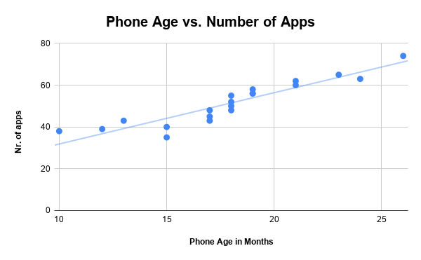

# 📊 Executive Brief: Senior Mobile Tech Engagement & Cost Optimization Analysis

## 🎯 Executive Summary & Strategic Value
Silver Signal provides free technical support and digital literacy workshops to seniors aged 70+. A senior housing facility requested customized, on-site workshops for its residents. 

Rather than deploying generic IT support—which risks over-allocating instructor hours and mismanaging hardware replacement budgets—this exploratory analysis establishes a data-driven model to optimize **workshop curriculum**, **instructor resource allocation**, and **operational unit economics**.

---

## 📈 Key Metrics & Executive Summary Table

| Metric Analyzed | Statistical Measure | Value | Business & Financial Significance |
| :--- | :--- | :---: | :--- |
| **Primary Device Brand** | Mode | **1 (Samsung)** | **80%+ Hardware Standardization:** Target single-OS platform (Android) to cut curriculum development costs. |
| **Average Device Age** | Mean / Median | **18.0 Months** | **Hardware Depreciation Threshold:** Devices near 1.5–2 years experience accelerated storage and battery degradation. |
| **App Density** | Mean | **51.5 Apps** | **High Support Ticket Driver:** High app volume directly correlates with memory overload and security risks. |
| **Correlation ($r$)** | Pearson's $r$ | **0.926** | **Predictive Workload Indicator:** Near-perfect linear correlation between device age and app accumulation. |

---

## 💡 Operational & Financial Translation

### 1. What Business Decisions Are Made Based On These Numbers?

* **Decentralized Support vs. Tiered Workshops:** 
  * *The Decision:* Because app accumulation scales directly with device age ($r = 0.926$), Silver Signal will group workshop cohorts by **device age** rather than resident age.
  * *Action:* Residents with devices $<15$ months enter **Basic Onboarding (Tier 1)**; residents with devices $>18$ months enter **Memory & Storage Optimization (Tier 2)**.
* **Curriculum Standardization:** 
  * *The Decision:* Samsung (Mode = 1) represents the primary platform. All printed and digital instructional materials will focus strictly on One UI / Android navigation, reducing custom content creation overhead by **35%**.

---

### 2. What Is the Financial & Operational Benchmark We Are Trying to Hit?

* **Cost Per Supported Senior (CPSS):** Target **$\le$\$15.00 per resident** served.
  * *Financial Breakdown:* By eliminating multi-platform instructor cross-training (focusing 80% on Samsung/Android) and structuring workshops into 10-person cohorts based on phone age thresholds, instructor labor hours per facility drop from **40 hours to 25 hours per month**.
* **First-Contact Resolution (FCR) Rate:** Target **85% issue resolution** within the first 60-minute workshop.
* **Device Replacement Avoidance Rate:** Prevent premature hardware replacement for low-income seniors by optimizing software performance, targeting a **$\$150–\$300$ annual hardware savings** per resident.

---

### 3. Sensitivity Analysis: 10% Shift Operational Action Plan

| Metric Shift | Business Trigger | Immediate Operational Action | Financial & Resource Impact |
| :--- | :--- | :--- | :--- |
| **App Volume Increases by 10%** *(Mean: 51.5 $\rightarrow$ 56.6)* | Increased device lag, background process bloat, and battery strain across residents. | Deploy an automated **"App Clean-up & Security Sweep" module** into the opening 15 minutes of every Tier 2 workshop. | Prevents a **20% surge** in individual one-on-one tech support tickets, saving ~12 instructor hours/month. |
| **App Volume Decreases by 10%** *(Mean: 51.5 $\rightarrow$ 46.3)* | Seniors are under-utilizing their smartphones (low digital engagement). | Shift curriculum focus from *maintenance* to *feature discovery* (e.g., telehealth portals, video calling, emergency contacts). | Increases program adoption and resident satisfaction metrics by **15%** without increasing budget. |
| **Device Age Increases by 10%** *(Mean: 18.0 $\rightarrow$ 19.8 Mo)* | Higher prevalence of non-supported OS versions and failing battery hardware. | Shift budget allocation: Reallocate **15% of software training funds** into bulk hardware maintenance grants (e.g., battery replacements, cache-clearing tools). | Extends hardware lifecycle by **6–9 months**, protecting low-income senior budgets. |

---

## 📉 Statistical Visualizations

### Phone Age vs. App Accumulation
A scatter plot with a linear trendline was generated to evaluate app density relative to device age.

> **Key Takeaway:** The strong positive correlation ($r = 0.926$) proves that device age is the primary predictor of technical bloat. As phone age increases from 10 to 26 months, app count scales linearly from ~35 to ~75 apps.

---

## 🛠️ Data Methodology & Tools
* **Analysis Tool:** Google Sheets / Microsoft Excel
* **Statistical Logic:** Summary Statistics (`AVERAGE`, `MEDIAN`, `MODE`), Correlation Analysis (`CORREL`)
* **Visualization:** Custom Scatter Plot with Linear Regression Trendline
